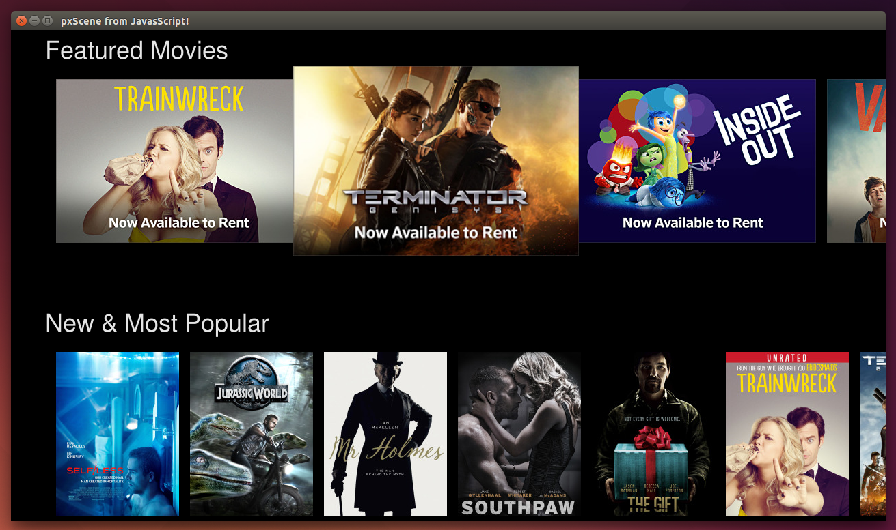

# xre2-prototype



Lab Week prototype of an On Demand menu using [pxscene](http://www.pxscene.org/) -- the UI framework for XRE2.

This service simulates the XRE application server.  It provides JavaScript modules and data models for rendering the menu.

The JavaScript modules call back to this service using HTTP to get the data models. 

This service gets the root menu and submenu for each gallery from the real Menu Web Service (using a hard coded ARS response).  It filters the menu data into lightweight JSON data structures, e.g., arrays of titles and imageURLs, and provides those lightweight models to the JavaScript modules.

> Requires node.js. Tested with version 4.2.2.

> Run the receiver and this service on different machines because pxscene depends on an older version of node.js.

1. Build the receiver (pxCore and JavaScript bindings) in an Ubuntu desktop VM:
https://www.teamccp.com/confluence/display/APPS/XRE2+PxScene+Setup

2. Clone this service on a different machine. Edit the configuration section of [index.js](index.js) to specify the IP the receiver will use to reach this service. For example,

    ```javascript
    var host = '10.0.2.2:3000';
    ```

3. Run this service.

    ```bash
    npm install
    node index.js
    ```
    
4.  Connect the receiver to this service.

    ```bash
    export PATH=$PATH:/opt/node/lib/node_modules/npm/bin/node-gyp-bin:/opt/node/bin
    cd ~/pxCore/examples/pxScene2d/src/jsbindings/
    # Replace IP with yours
    ./start.sh http://10.0.2.2:3000/scene/menu
    ```	
    
5.  Expect a navigable On Demand menu in a OS native window.
